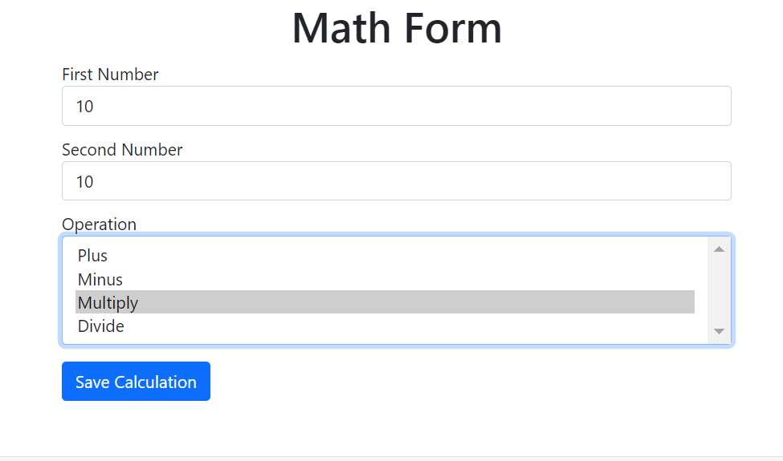
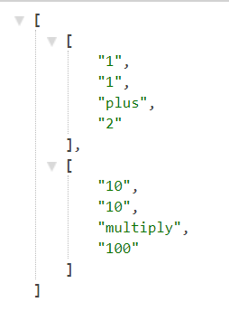

# Java Rest API

## Description

This is a simple app that allows users to enter 2 numbers and an operation. A result is calculated on the backend. The numbers, operation and result are made available for use as a REST API.

## Table of Contents
[Installation](#installation) 
[Usage](#usage) 
[Tech Stack](#tech-stack) 
[Screenshots](#screenshots) 
[Future Development](#directions-for-future-development) 
[Author](#author) 
[Questions](#questions)

## Installation

Run `java -version` and `mvn -version` in your root directory to make sure you have 'JDK' and 'Apache Maven' installed on your machine.

1. Clone this repository to your local machine.
2. Open the directory in a terminal.

## Usage

1. Run the command `mvn spring-boot:run` in your terminal
2. Open http://localhost:8080 
3. Fill out the form and click the *Save Calculation* button.
4. Navigate to http://localhost:8080/api/maths

You should see your input and a result displayed as a JSON Array. Please note that as data is not being stored in a database, it will not persist. The JSON array will not hold your previous calculation at this stage.

## Tech Stack
 
- Java Spring Framework
- Apache Maven
- Thymeleaf

## Screenshots 

1. Expected output on http://localhost:8080

2. Expected output on http://localhost:8080/api/maths

## Directions for Future Development

- Store data in a SQL or NoSQL database so that it persists.
- Develop PUT and DELETE requests (currently there are only GET & POST).

## Author

Prabh Singh - https://github.com/prabhm512

## Questions

Please reach out to me via teams or email me at `prabhm512@gmail.com` if you run into any trouble while instaling or using the app.